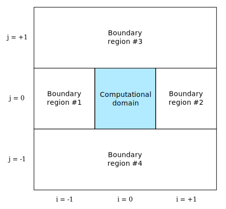

# Boundary Parameters

This set of parameters, contained in the namelist block `&BOUNDARY_PARAMS`, is used to set up boundary conditions on the current simulation. If this namelist block is absent, periodic boundary conditions are assumed. Setting up other types of boundary conditions in RAMSES is quite complex. The default setting, corresponding to a periodic box, should be sufficient in most cases. The strategy to set up boundary conditions is based on using "ghost regions" outside the computational domain, where flow variables are carefully specified in order to mimic the effect of the chosen type of boundary. Note that the order in which boundary regions are specified in the namelist is very important, especially for reflexive or zero gradient boundaries. Specific examples can be found in the namelist/ directory of the package.

| Variable name, syntax, default value | Fortran type | Description |
|:---------------------------- |:------------- |:------------------------- |
| `nboundary=1`  | `integer` | Number of ghost regions used to specify the boundary conditions.|
| `bound_type=0,0,0,` | `integer array` | Type of boundary conditions to apply in the corresponding ghost region. Possible values are: `bound_type=0` (periodic), `bound_type=1` (reflexive), `bound_type=2` (outflow, zero gradients), `bound_type=3` (inflow, user specified).|
| `d_bound=0.0` `u_bound=0.0` `v_bound=0.0` `w_bound=0.0` `p_bound=0.0` | `real arrays` | Flow variables in each ghost region (density, velocities and pressure). They are used only for inflow boundary conditions.|
| `ibound_min=0` `jbound_min=0` `kbound_min=0` | `integer arrays` | Coordinates of the lower, left, bottom corner of each boundary region. Each coordinate lies between -1 and +1 in each direction. |
| `ibound_max=0` `jbound_max=0` `kbound_max=0` | `integer arrays` | Likewise, for the upper, right and upper corner of each boundary region. |

## Example



The 4 boundary regions shown in the above figure are defined by the following
namelist block:
```config
&BOUNDARY_PARAMS
nboundary=4
ibound_min=-1,+1,-1,-1
ibound_max=-1,+1,+1,+1
jbound_min= 0, 0,+1,-1
jbound_max= 0, 0,+1,-1
bound_type= 1, 1, 1, 1
/
```
The first region is located in the rectangle defined by coordinate (i=-1,j=0), while the third region
is defined by coordinates (-1≤i≤+1, j=+1). The boundary type for all 4 regions is set to
“reflexive” (bound_type=1). The fluid variables within the ghost region are therefore taken
equal to the values of their symmetric cells, with respect to the boundary. This is why the order
of the ghost regions is so important: regions 1 and 2 are updated first, using only the fluid
variables within the computational domain. Regions 3 and 4 are updated afterwards, using the
fluid variables within the computational domain, but also within regions 1 and 2.

In this way, all
cells within boundary regions are properly defined, especially in the 4 corners of the
computational domain.
It is possible to define only 2 regions (say region 1 and 2 in the Figure), the orthogonal direction
will be considered as periodic. For gravity runs, the gravitational force is also updated in the
ghost regions, following the same rules than for the velocity vector.
